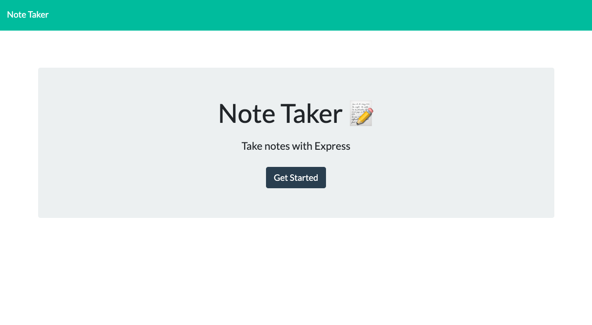
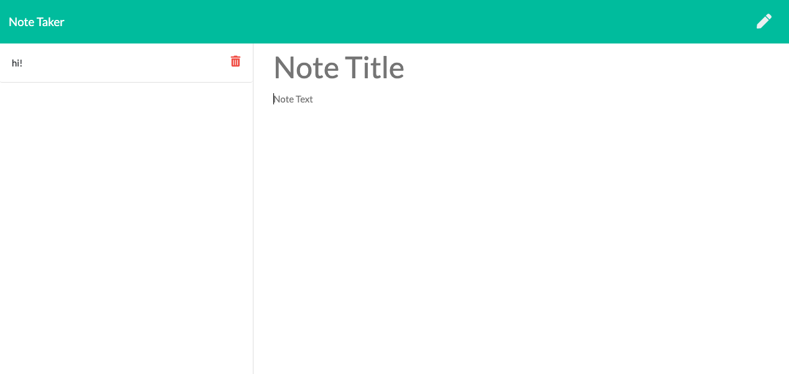

# note-taker

<h2> PWA Budget Tracker </h2> 

<h2> Author </h2>

Kendall Masterson

https://github.com/mastersonkl

masterson.kendall@gmail.com

<h2> Description </h2>

This is a note taking application. You can write, save, and edit notes. Express is used to save and retrieve the notes. 

**## Table of Contents**

- [Installation Instructions](#installation-instructions)
- [Usage Information](#usage-information)

## Installation Instructions

You can install this program by cloning it to your local machine by running `git clone`. Run `npm i` to install the dependencies included in the package.json. After installing the program, run it in your terminal using node `node db.js`.

## Usage Information

This application is deployed on Heroku and can be found here: https://note-taker-ke.herokuapp.com/

